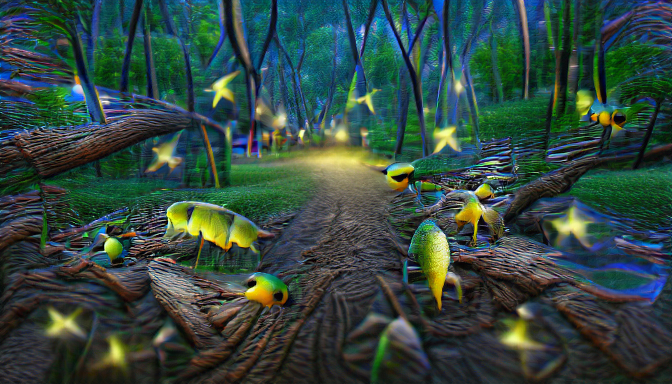
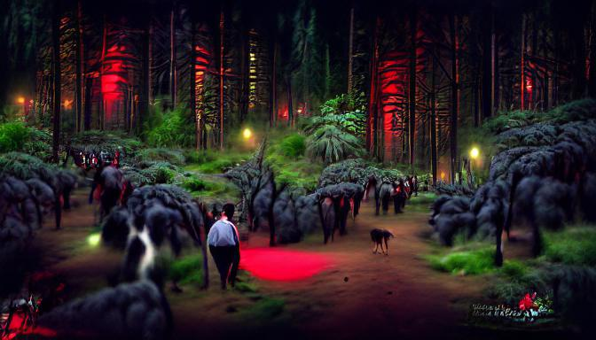
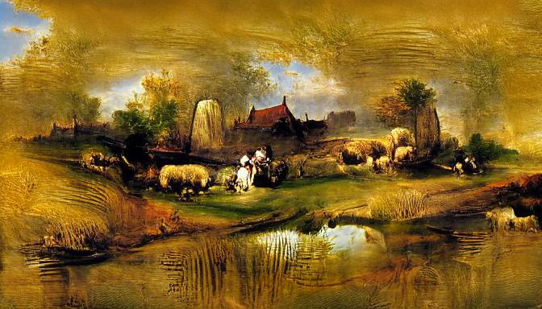
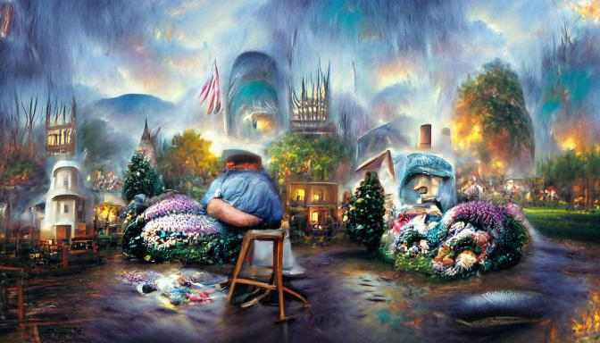
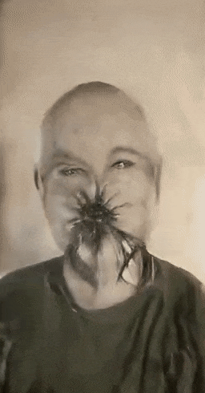

# VQGAN-CLIP-GENERATOR Overview

This is a package (with available [notebook](vqgan_clip_generator.ipynb)) for running VQGAN+CLIP locally, with a focus on ease of use, good documentation, and generating smooth style transfer videos. There are [three main user-facing functions](#functions): generate.image(), generate.video_frames(), and generate.style_transfer().

This package started as a complete refactor of the code provided by [NerdyRodent](https://github.com/nerdyrodent/), which started out as a Katherine Crowson VQGAN+CLIP-derived Google colab notebook.

In addition to refactoring NerdyRodent's code into a more pythonic package to improve usability, this project includes the following noteable elements:
* Significant improvements to the quality of style transfer videos
* Video smoothing/deflicker by applying EWMA to latent vector series
* A wrapper for Real-ESRGAN for  unit tests
* Improvements to generated image quality derived from the use of NerdyRodent's cut method code
* Example code for video includes optical flow interpolation using RIFE
* A google colab [notebook](vqgan_clip_generator.ipynb)

Some [sample](samples) images:

</img>
</img>
</img>
</img>
</img>

Environment:

* Tested on Windows 10 build 19043
  * GPU: Nvidia RTX 3080 10GB
  * CPU: AMD 5900X
* Also tested in Google Colab (free and pro tiers) using [this notebook](vqgan_clip_generator.ipynb).
* Typical VRAM requirements:
  * 24 GB for a 900x900 image (1200x675 in 16:9 format)
  * 16 GB for a 700x700 image (933x525 in 16:9 format)
  * 10 GB for a 512x512 image (684x384 in 16:9 format)
  * 8 GB for a 380x380 image (507x285 in 16:9 format)


# Setup
## Virtual environment
This example uses [Anaconda](https://docs.conda.io/en/latest/miniconda.html) to manage virtual Python environments. Create a new virtual Python environment for VQGAN-CLIP-GENERATOR. Then, install the dependencies and this VQGAN-CLIP-GENERATOR package using pip. If you are completely new to python and just want to make some art, I have a [quick start guide](BEGINNERS.md).

```sh
conda create --name vqgan python=3.9 pip ffmpeg numpy pytest tqdm git pytorch==1.9.0 torchvision==0.10.0 torchaudio==0.9.0 cudatoolkit=11.1 -c pytorch -c conda-forge
conda install -c conda-forge ffmpeg
conda install ipykernel
conda activate vqgan
pip install git+https://github.com/openai/CLIP.git taming-transformers ftfy regex tqdm pytorch-lightning kornia imageio omegaconf torch_optimizer piexif
pip install git+https://github.com/rkhamilton/vqgan-clip-generator.git
```

The library is under active development as of November 2021. To upgrade to the latest version, use pip to update the package.
```sh
pip install git+https://github.com/rkhamilton/vqgan-clip-generator.git --upgrade 
```
If you want to get into the guts of the code and run a local development copy so you can tinker with the algorithm (be my guest!), do not use pip to install it. Instead, clone and setup in develop mode.
```sh
git clone https://github.com/rkhamilton/vqgan-clip-generator.git
cd .\vqgan-clip-generator\
python setup.py develop
```

## Quick example to confirm that it works
```python
import vqgan_clip.generate
from vqgan_clip.engine import VQGAN_CLIP_Config
import os

config = VQGAN_CLIP_Config()
config.output_image_size = [128,128]
vqgan_clip.generate.image(eng_config = config,
        text_prompts = 'A pastoral landscape painting by Rembrandt',
        iterations = 100,
        output_filename = 'output.png')
```

## Optionally, install Real-ESRGAN for image upscaling
[Real-ESRGAN](https://github.com/xinntao/Real-ESRGAN) is a package that uses machine learning for image restoration, including upscaling and cleaning up noisy images. Given that VQGAN+CLIP output sizes are significantly limited by available VRAM, using a sophisticated upscaler can be useful.

To install Real-ESRGAN for use in this package, run the commands below. See [Real-ESRGAN.md](Real-ESRGAN.md) for additional instructions, including use of custom upscaling/restoration models.
```sh
conda activate vqgan
pip install opencv-python scipy
pip install basicsr
pip install facexlib
pip install gfpgan
pip install git+https://github.com/xinntao/Real-ESRGAN
```
## Optionally, download arXiv2020-RIFE
The project [arXiv2020-RIFE](https://github.com/hzwer/arXiv2020-RIFE) is an optical flow interpolation implementation for increasing the framerate of existing video. Optical flow creates extra frames of video that smoothly move visual elements from their positions in the first frame to their positions in the second frame. 

I've provided [examples](examples) of how you can combine Real-ESRGAN and RIFE to upscale and interpolate generated content.

In addition to the setup commands above, run the following commands to set up RIFE. Please note that RIFE does not offer an installable python package, unlike the packages above. You will have to clone their repository to the working directory you plan to use for your VQGAN+CLIP projects. Then, [download the RIFE trained model v3.8](https://drive.google.com/file/d/1O5KfS3KzZCY3imeCr2LCsntLhutKuAqj/view?usp=sharing) to the *./arXiv2020-RIFE/train_log/* folder.
```sh
conda activate vqgan
pip install sk-video
pip install opencv-python
pip install moviepy
git clone git@github.com:hzwer/arXiv2020-RIFE.git
```

## If using an AMD graphics card

The instructions above assume an nvidia GPU with support for CUDA 11.1. Instructions for an AMD GPU below are courtesy of NerdyRodent. Note: I have not tested this advice.

ROCm can be used for AMD graphics cards instead of CUDA. You can check if your card is supported here:
<https://github.com/RadeonOpenCompute/ROCm#supported-gpus>

Install ROCm accordng to the instructions and don't forget to add the user to the video group:
<https://rocmdocs.amd.com/en/latest/Installation_Guide/Installation-Guide.html>

The usage and set up instructions above are the same, except for the line where you install Pytorch.
Instead of `pip install torch==1.9.0+cu111 ...`, use the one or two lines which are displayed here (select Pip -> Python-> ROCm):
<https://pytorch.org/get-started/locally/>

## If using the CPU

If no graphics card can be found, the CPU is automatically used and a warning displayed. In my testing, a RTX 3080 GPU is >25x faster than a 5900X CPU. Using a CPU may be impractically slow.

This works with the CUDA version of Pytorch, even without CUDA drivers installed, but doesn't seem to work with ROCm as of now.

## Uninstalling

Remove the Python enviroment:

```sh
conda deactivate
conda remove --name vqgan --all
```
Remove any cached model files at *~\cache\torch\hub\models*.

# Generating images and video
## Functions
Generating images and video is done through functions in the vqgan_clip.generate module. For the functions that generate folders of images, you may optionally conver them to video using the included video_tools.encode_video() method, which is a wrapper for ffmpeg.
|Function|Purpose|
|--------|-------|
|generate.image()|Generate a single image.|
|generate.video_frames()|Generate a sequence of images by running the VQGAN training while periodically saving the generated images to unique files. The resulting images can "zoom in" or translate around if you use optional arguments to transform each generated frame of video. The result is a folder of images that can be combined using (e.g.) ffmpeg.|
|generate.style_transfer()|Apply VQGAN_CLIP to each frame of an existing video. This is an enhancement of the standard style transfer algorithm that has improvements to the fluidity of the resulting video. The result is a folder of images that can be combined using (e.g.) ffmpeg.|

## Prompts
Prompts are objects that can be analyzed by CLIP to identify their contents. The resulting images will be those that are similar to the prompts. Prompts can be any combination of text phrases, example images, or random number generator seeds. Each of these types of prompts is in a separate string, discussed below.

Multiple prompts can be combined, both in parallel and in series. Prompts that should be used in parallel are separated by a pipe symbol, like so:
```python
'first parallel prompt | second parallel prompt'
```
Prompts that should be processed in series should be separated by a carat (^). Serial prompts, sepated by ^, will be cycled through after a user-specified number of video frames. If more prompt changes are requested than there are serial prompts available, the last prompt will be used. This feature is not applicable to generating single images.

```python
'first serial prompt ^ second serial prompt'
```

Prompts may be given different weights by following them with ':float'. A weight of 1.0 is assumed if no value is provided.
```python
'prompt 10x more weighted:1.0 | prompt with less weight:0.1'
```

These methods may be used in any combination.
```python
'prompt 1:1.0 | prompt 2:0.1 | prompt 3:0.5 ^ prompt 4 | prompt 5 | prompt 6:2.0'
```

# Parameters
There are a lot of degrees of freedom you can change when creating generative art. I describe the parameters of this package below, and try to highlight the most important considerations in the text.

The parameters used for image generation are either passed to a method of generate.py, or stored in a VQGAN_CLIP_Config instance. These two groups of configuration parameters are discussed below.

## Parameters common to vqgan_clip.generate.*
These parameters are common to all of the functions of vqgan_clip.generate: image(), video_frames(), style_transfer().
|Function Argument|Default|Meaning
|---------|---------|---------|
|text_prompts|'A painting of flowers in the renaissance style:0.5\|rembrandt:0.5^fish:0.2\|love:1'|Text prompt for image generation|
|image_prompts|[]|Path to image(s) that will be turned into a prompt via CLIP. The contents of the resulting image will have simiar content to the prompt image(s), as evaluated by CLIP.|
|noise_prompts|[]|Random number seeds can be used as prompts using the same format as a text prompt. E.g. '123:0.1\|234:0.2\|345:0.\|3' Stories (^) are supported. |
|init_image|None|A seed image that can be used to start the training. Without an initial image, random noise will be used.|
|save_every|50|An interim image will be saved to the output location every save_every iterations. If you are generating a video, a frame of video will be created every save_every iterations.|
|output_filename|'output.jpg'|Location to save the output image file when a single file is being created. All [filetypes supported by Pillow](https://pillow.readthedocs.io/en/stable/handbook/image-file-formats.html) should work. Only PNG and jpg files will have metadata embedded that describes generation parameters.|
|verbose|False|Determines whether training diagnostics should be displayed every time a file is saved.|

## Parameters specific to generate.image()
|Function Argument|Default|Meaning
|---------|---------|---------|
|iterations|100|Number of iterations of train() to perform before stopping and outputing the image. The resulting still image will eventually converge to an image that doesn't perceptually change much in content.|

## Parameters specific to generate.video_frames()
|Function Argument|Default|Meaning
|---------|---------|---------|
|num_video_frames||Number of frames of video to generate.|
|iterations_per_frame|30|Number of iterations of train() to perform on each generated video frame|
|iterations_for_first_frame|100|Number of extra iterations of train() to perform on the first frame of video so the image isn't a gray field.|
|change_prompts_on_frame|None|All serial prompts (separated by "^") will be cycled forward on the video frames provided here. If more changes are requested than prompts are available, the last prompt is used.|
|generated_video_frames_path|'./video_frames'|Location where multiple_images() will save output.|
|zoom_scale|1.0|When using zoom_video(), this parameter sets the ratio by which each frame will be zoomed in relative to the previous.|
|shift_x|0| When using zoom_video(), this parameter sets how many pixels each new frame will be shifted in the x direction.|
|shift_y|0| When using zoom_video(), this parameter sets how many pixels each new frame will be shifted in the x direction.|
|z_smoother|False|When True, flicker is reduced and frame-to-frame consistency is increased at the cost of some motion blur. Recent latent vectors used for image generation are combined using a modified [EWMA](https://en.wikipedia.org/wiki/Moving_average) calculation. This averages together multiple adjacent image latent vectors, giving more weight to a central frame, and exponentially less weight to preceeding and succeeding frames.|
|z_smoother_buffer_len|5|Sets how many latent vectors (images) are combined using an EWMA. Bigger numbers will combine more images for more smoothing, but may make blur rapid changes. The center element of this buffer is given the greatest weight. Must be an odd number.|
|z_smoother_alpha|0.7|Sets how much the adjacent latent vectors contribute to the final average. Bigger numbers mean the keyframe image will contribute more to the final output, sharpening the result and increasing flicker from frame to frame.|

## Parameters specific to generate.style_transfer()
|Function Argument|Default|Meaning
|---------|---------|---------|
|iterations_per_frame|30|Number of iterations of train() to perform on each generated video frame|
|change_prompts_on_frame|None|All serial prompts (separated by "^") will be cycled forward on the video frames provided here. If 
|current_source_frame_image_weight|2.0|Higher numbers make the output video look more like the input video.|
|current_source_frame_prompt_weight|0.0|Higher numbers make the output video look more like the *content* of the input video *as assessed by CLIP*. It treats the source frame as an image_prompt.|
## VQGAN_CLIP_Config
Other configuration attributes can be seen in vqgan_clip.engine.VQGAN_CLIP_Config. These options are related to the function of the algorithm itself. For example, you can change the learning rate of the GAN, or change the optimization algorithm used, or change the GPU used. Instantiate this class and customize the attributes as needed, then pass this configuration object to a method of vqgan_clip.generate. For example:
```python
config = VQGAN_CLIP_Config()
config.output_image_size = [587,330]
vqgan_clip.generate.image(eng_config = config,text_prompt='a horse')
```
|VQGAN_CLIP_Config Attribute|Default|Meaning
|---------|---------|---------|
|output_image_size|[256,256]|x/y dimensions of the output image in pixels. This will be adjusted slightly based on the CLIP model used. VRAM requirements increase steeply with image size. My video card with 10GB of VRAM can handle a size of [500,500], or [684,384] in 16:9 aspect ratio. **Note that a lower resolution output does not look like a scaled-down version of a higher resolution output.** Lower res images have less detail for CLIP to analyze and will generate different results than a higher resolution workflow.|
|vqgan_model_name|f'models/vqgan_imagenet_f16_16384'|Name of the pre-trained VQGAN model to be used.|
|vqgan_model_yaml_url|f'https://heibox.uni-heidelberg.de/d/a7530b09fed84f80a887/files/?p=%2Fconfigs%2Fmodel.yaml&dl=1'|Name of the pre-trained VQGAN model to be used. [Select a valid model name](#dynamic-model-download-and-caching).|
|vqgan_model_ckpt_url|f'https://heibox.uni-heidelberg.de/d/a7530b09fed84f80a887/files/?p=%2Fckpts%2Flast.ckpt&dl=1'|Name of the pre-trained VQGAN model to be used. [Select a valid model name](#dynamic-model-download-and-caching).|
|model_dir|None|If set to a folder name (e.g. 'models') then model files will be downloaded to a subfolder of the current working directory. This may be helpful if your default drive, used by PyTorch, is small.|
|init_noise|None|Seed an image with noise. Options None, 'pixels' or 'gradient' |
|init_weight|0.0|A weight can be given to the initial image used so that the result will 'hold on to' the look of the starting point.
|init_noise|None|Seed an image with noise. Options None, 'pixels' or 'gradient'|
|cut_method|'kornia'|Sets the method used to generate cutouts which are fed into CLIP for evaluation. 'original' is the method from the original Katherine Crowson colab notebook. 'kornia' includes additional transformations and results in images with more small details. Defaults to 'kornia'.|
|seed|None|Random number generator seed used for image generation. Reusing the same seed does not ensure perfectly identical output due to some nondeterministic algorithms used in PyTorch.|
|optimizer|'Adam'|Different optimizers are provided for training the GAN. These all perform differently, and may give you a different result. See [torch.optim documentation](https://pytorch.org/docs/stable/optim.html).|
|init_weight_method|'original'|Method used to compare current image to init_image. 'decay' will let the output image get further from the source by flattening the original image before letting the new image evolve from the flattened source. The 'decay' method may give a more creative output for longer iterations. 'original' is the method used in the original Katherine Crowson colab notebook, and keeps the output image closer to the original input. This argument is ignored for style transfers.|

# Dynamic model download and caching

The VQGAN algorithm requires use of a compatible model. These models consist of a configuration file (.yaml) and a checkpoint file (.ckpt). These files are not provided with the pip intallation, and must be downloaded separately. As of version 1.1 of VQGAN_CLIP_GENERATOR, these files are downloaded the first time they are used, and cached locally in the users ~/.cache/torch/hub/models folder. Depending on the models you've used, these can take up several gigabytes of storage, so be aware that they are cached in this location. Uninstallation of this package does not remove cached files.


The [pretrained models are discussed in more detail by CompVis](https://github.com/CompVis/taming-transformers#overview-of-pretrained-models). The default model used in this package is vqgan_imagenet_f16_16384. Other models that seem to be in frequent use with VQGAN+CLIP implementaitons are shown below, and are all expected to be compatible. These models will have different abilities to generate content based on their training sets.

|Dataset|Model Config|Model Checkpoint|
|-------|------------|----------------|
|VQGAN ImageNet (f=16), 1024|[vqgan_imagenet_f16_1024.yaml](https://heibox.uni-heidelberg.de/d/8088892a516d4e3baf92/files/?p=%2Fconfigs%2Fmodel.yaml&dl=1)|[vqgan_imagenet_f16_1024.ckpt](https://heibox.uni-heidelberg.de/d/8088892a516d4e3baf92/files/?p=%2Fckpts%2Flast.ckpt&dl=)|
|VQGAN ImageNet (f=16), 16384|[vqgan_imagenet_f16_16384.yaml](https://heibox.uni-heidelberg.de/d/a7530b09fed84f80a887/files/?p=%2Fconfigs%2Fmodel.yaml&dl=1)|[vqgan_imagenet_f16_16384.ckpt](https://heibox.uni-heidelberg.de/d/a7530b09fed84f80a887/files/?p=%2Fckpts%2Flast.ckpt&dl=1)|
|VQGAN OpenImages (f=8), 8192, GumbelQuantization|[vqgan_gumbel_f8.yaml](https://heibox.uni-heidelberg.de/d/2e5662443a6b4307b470/files/?p=%2Fconfigs%2Fmodel.yaml&dl=1)|[vqgan_gumbel_f8.ckpt](https://heibox.uni-heidelberg.de/d/2e5662443a6b4307b470/files/?p=%2Fckpts%2Flast.ckpt&dl=1)|
|S-FLCKR (f=16)|[sflckr.yaml](https://heibox.uni-heidelberg.de/d/73487ab6e5314cb5adba/files/?p=%2Fconfigs%2F2020-11-09T13-31-51-project.yaml&dl=1)|[sflckr.ckpt](https://heibox.uni-heidelberg.de/d/73487ab6e5314cb5adba/files/?p=%2Fcheckpoints%2Flast.ckpt&dl=1)|
|COCO-Stuff (f=16)|[coco_transformer.yaml](https://dl.nmkd.de/ai/clip/coco/coco.yaml)|[coco_transformer.ckpt](https://dl.nmkd.de/ai/clip/coco/coco.ckpt)|

In order to use a non-default model, configure the VQGAN_CLIP_GENERATOR engine as in the example below:
```python
config = VQGAN_CLIP_Config()
config.vqgan_model_name = 'sflckr'
config.vqgan_model_yaml_url = f'https://heibox.uni-heidelberg.de/d/73487ab6e5314cb5adba/files/?p=%2Fconfigs%2F2020-11-09T13-31-51-project.yaml&dl=1'
config.vqgan_model_ckpt_url = f'https://heibox.uni-heidelberg.de/d/73487ab6e5314cb5adba/files/?p=%2Fcheckpoints%2Flast.ckpt&dl=1'
vqgan_clip.generate.image(eng_config = config,
        text_prompts='an apple')
```

# Examples
## Example Scripts
The [examples folder](examples) has the follow scripts available for you to download and customize. These scripts combine all of the available function arguments and additional tools that I've found useful for routine use: upscaling using Real-ESRGAN, and optical flow interpolation using RIFE.
|Example|Description|
|-------|-----------|
|[single_image.py](examples/single_image.py)|Generate a single image from a text prompt.|
|[image_prompt.py](examples/image_prompt.py)|Generate a single image from an image prompt. The output will have the same content as the image prompt, as assessed by CLIP.|
|[multiple_same_prompts.py](examples/multiple_same_prompts.py)|Generate a folder of images using the same prompt, but different random number seeds. This is useful to fish for interesting images.|
|[multiple_many_prompts.py](examples/multiple_many_prompts.py)|Generate a folder of images by combining your prompt with a number of "keyword" prompts that have a big impact on image generation.|
|[video.py](examples/video.py)|Generate images where the prompts change over time, and use those images to create a video.|
|[zoom_video.py](examples/zoom_video.py)|Generate images where the images zoom and shift over time, and use those images to create a video.|
|[upscaling_video.py](examples/upscaling_video.py)|Demo of how to use Real-ESRGAN to upscale an existing video.|
|[custom_zoom_video.py](examples/custom_zoom_video.py)|Example of how you can re-use and modify the generate.video_frames() function to create unique behaviors. In this example the zooming and shifting changes over the course of the video.|
|[style_transfer.py](examples/style_transfer.py)|Apply a VQGAN+CLIP style to an existing video. This is the showcase feature of the package (discussed below).|
|[style_transfer_exploration.py](examples/style_transfer_exploration.py)|Explore the output of generate.style_transfer() for combinations of parameter values. Useful to dial in the settings for your style transfer, and then use the best settings to generate your video using generate.style_transfer().|

Below is a brief discussion of a few specific examples.
## Generating a single image from a text prompt
In the example below, an image is generated from two text prompts: "A pastoral landscape painting by Rembrandt" and "A blue fence." These prompts are given different weights during image genration, with the first weighted ten-fold more heavily than the second. This method of applying weights may optionally be used for all three types of prompts: text, images, and noise. If a weight is not specified, a weight of 1.0 is assumed.

```python
# Generate a single image based on a text prompt
from vqgan_clip import generate, esrgan
from vqgan_clip.engine import VQGAN_CLIP_Config
import os

config = VQGAN_CLIP_Config()
config.output_image_size = [587,330]
text_prompts = 'A pastoral landscape painting by Rembrandt:1.0 | A blue fence:0.1'

generate.image(eng_config = config,
        text_prompts = text_prompts,
        iterations = 100,
        output_filename = 'output.png')
```

## Generating a single image from a text prompt and initial image
In this example, an initial image is added to the code above, so that the GAN is seeded with this starting point. The output image will have the same aspect ratio as the initial image.

```python
from vqgan_clip import generate, esrgan
from vqgan_clip.engine import VQGAN_CLIP_Config
import os

config = VQGAN_CLIP_Config()
config.output_image_size = [587,330]
text_prompts = 'A pastoral landscape painting by Rembrandt:1.0 | A blue fence:0.1'

generate.image(eng_config = config,
        text_prompts = text_prompts,
        iterations = 100,
        init_image = 'starting_image.jpg',
        output_filename = 'output.png')
```
## Style Transfer
The method generate.style_transfer() will apply VQGAN+CLIP prompts to an existing video by extracting frames of video from the original and using them as inputs to create a frame of output video. The resulting frames may be combined into a video, and the original audio is optionally copied to the new file. As an example, here is a video of my face restyled with the prompt "portrait covered in spiders charcoal drawing" with 60 iterations per frame, and current_source_frame_image_weight = 3.2 ([full code to generate this video](examples/style_transfer.py)).  
</img>

The innovations used in this approach are:
* Each frame of generated video is initialized using the previous *output* frame of *generated* video. This ensures that the next generated frame has a starting image that partially satisfies the CLIP loss function. Doing so greatly reduces the changes that the new frame of video will train toward a very different optimimum, which is responsible for the characteristic flicker in most VQGAN+CLIP style transfer videos.
* The training process evolves the image from the previous generated image toward the next source frame of video, thereby tracking the original source video frame-by-frame. Increasing current_source_frame_image_weight causes the output video to follow the source image more closely.
* You may elect to set the current source image frame as an image prompt. This will cause the resulting output frames to have more similarity (according to CLIP) to the source frame. This is done by increasing current_source_frame_prompt_weight.

A few tips for style transfers:
* If you want the output to look more like the input, your prompts should describ the original video as well as the new style. In the example above, I started with a selfie-video, and the prompt included the word "portrait." Without the word portrait, the result shifts much more toward a charcoal drawing of spiders with fewer human elements. You may also have success using the current_source_frame_prompt_weight parameter to use the source frame as an image prompt if you want to retain elements of the original video without describing the source material in a text prompt.
* The parameter current_source_frame_image_weight affects how close the final pixels of the image will be to the source material. At a weight of >8, the output will be very similar to the input. At a weight of <1.0 the output will be very different from the source material. A weight of 0.0 would not track the rest of the video after the first frame, and would be very similar to a generate.video_frames().
* The iterations_per_frame has a strong effect on the look of the output, and on the frame-to-frame consistency. At high iterations (>100) each frame has a lot of opportunity to change significantly from the previous frame. At low iterations (<5), and low current_source_frame_image_weight values, the output may not have a chance to change toward the new source material image.
* For example:
  * iterations_per_frame=300, current_source_frame_image_weight=0.2, [is a wild ride](samples/style_transfer_wild.mp4) with a lot of change from the source, and variation from frame to frame (flicker). The flicker could be smoothed by using z_smoother_alpha=0.7 or lower.
  * iterations_per_frame=15, current_source_frame_image_weight=4, would be gentle stylig applied to the original video.
* You may have success using a lower extraction_framerate (7.5 or 15) and then using RIFE (optical flow interpolation) to interpolate the output up to 60/120 FPS.
## Custom scripts
The [generate.py](src/vqgan_clip/generate.py) file contains the common functions that users are expected to use to create content. However, you should feel free to copy methods from this file and customize them for your own projects. The code in generate.py is still pretty high level, with the implementation details buried in engine and _functional. I've provided [an example file](examples/custom_zoom_video.py) where I just extracted the zoom_video_frames method and turned it into a script so that you can see how you might make some creative changes. A few ideas:
* Change the image prompt weights over time to create smoother content transitions
* Change the interval at which video frames are exported over time, to create the effect of speeding or slowing video
* Create style transfer videos where each frame uses many image prompts, or many previous frames as image prompts
* Create a zoom video where the shift_x and shift_x change over time to create spiraling zooms, or the look of camera movements
* It's art. Go nuts!

# Support functions
A few supporting tools are provided. Documentation is provided in docstrings, and the examples folder demonstrates their use.
## Functions
|Function|Purpose|
|--------|-------|
|video_tools.extract_video_frames()|Wrapper for ffmpeg to extract video frames.|
|video_tools.copy_video_audio()|Wrapper for ffmpeg to copy audio from one video to another.|
|video_tools.encode_video()|Wrapper for ffmpeg to encode a folder of images to a video.|
|esrgam.inference_realesrgan()|Functionalized version of the Real-ESRGAN inference_realesrgan.py script for upscaling images.|
## Function arguments
|Function Argument|Default|Meaning
|---------|---------|---------|
|extraction_framerate|30|When extracting video frames from an existing video, this sets how many frames per second will be extracted. Interpolation will be used if the video's native framerate differs.|
|extracted_video_frames_path|'./extracted_video_frames'| Location where extract_video_frames will save extracted frames of video from the source file.|
|input_framerate|30|When combining still images to make a video, this parameter can be used to force an assumed original framerate. For example, you could assume you started with 10fps, and interpolate to 60fps using ffmpeg or RIFE.|
|output_framerate|None|Desired framerate of the output video from encode_video. If ommitted, the input_framerate willb e used. If supplied, ffmpeg will interpolate the video to the new output framerate. If you are using RIFE for optical flow interpolation, it is not recommended to first interpolte with ffmpeg.|

# Troubleshooting

## RuntimeError: CUDA out of memory
For example:
```
RuntimeError: CUDA out of memory. Tried to allocate 150.00 MiB (GPU 0; 23.70 GiB total capacity; 21.31 GiB already allocated; 78.56 MiB free; 21.70 GiB reserved in total by PyTorch)
```
Your request doesn't fit into your GPU's VRAM. Reduce the image size and/or number of cuts.

# Citations

```bibtex
@misc{unpublished2021clip,
    title  = {CLIP: Connecting Text and Images},
    author = {Alec Radford, Ilya Sutskever, Jong Wook Kim, Gretchen Krueger, Sandhini Agarwal},
    year   = {2021}
}
```

```bibtex
@misc{esser2020taming,
      title={Taming Transformers for High-Resolution Image Synthesis}, 
      author={Patrick Esser and Robin Rombach and Björn Ommer},
      year={2020},
      eprint={2012.09841},
      archivePrefix={arXiv},
      primaryClass={cs.CV}
}
```

Katherine Crowson - <https://github.com/crowsonkb>
NerdyRodent - <https://github.com/nerdyrodent/>

Public Domain images from Open Access Images at the Art Institute of Chicago - <https://www.artic.edu/open-access/open-access-images>
