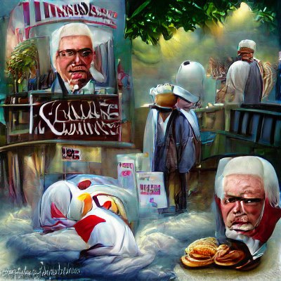

# VQGAN-CLIP-GENERATOR Overview

This is a package for running VQGAN+CLIP locally, with a focus on ease of use. I was motivated to create a version of this tool that would let me mix and match functions so that I could more easily experiment with way to apply a GAN style to an existing video. The key feature in this package is generate.restyle_video(), which will create a smoothly animating, GAN-styled video from an existing video.

This package started as a complete refactor of the code provided by [NerdyRodent](https://github.com/nerdyrodent/), which started out as a Katherine Crowson VQGAN+CLIP derived Google colab notebook.

In addition to refactoring NerdyRodent's code into a more pythonic package to improve usability, this project adds unit tests, and adds improvements to the ability to restyle an existing video.

Some example images:

</img>
</img>
</img>  
</img>


Environment:

* Tested on Windows 10 build 19043
* GPU: Nvidia RTX 3080
* CPU: AMD 5900X
* Typical VRAM requirements:
  * 24 GB for a 900x900 image (1200x675 in 16:9 format)
  * 10 GB for a 512x512 image (684x384 in 16:9 format)
  * 8 GB for a 380x380 image (507x285 in 16:9 format)

## Setup
### Virtual environment
This example uses [Anaconda](https://docs.conda.io/en/latest/miniconda.html) to manage virtual Python environments. Create a new virtual Python environment for VQGAN-CLIP-GENERATOR. Then, install the VQGAN-CLIP-GENERATOR package using pip. If you are completely new to python and just want to make some art, I have a [quick start guide](BEGINNERS.md).

```sh
conda create --name vqgan python=3.9 pip ffmpeg numpy pytest tqdm git pytorch==1.9.0 torchvision==0.10.0 torchaudio==0.9.0 cudatoolkit=11.1 -c pytorch -c conda-forge
conda install -c conda-forge ffmpeg
conda activate vqgan
pip install git+https://github.com/openai/CLIP.git taming-transformers ftfy regex tqdm pytorch-lightning kornia imageio omegaconf torch_optimizer
pip install git+https://github.com/rkhamilton/vqgan-clip-generator.git
```

### Quick example to confirm that it works
```python
import vqgan_clip.generate
from vqgan_clip.engine import VQGAN_CLIP_Config
import os

config = VQGAN_CLIP_Config()
config.output_image_size = [128,128]
text_prompts = 'A pastoral landscape painting by Rembrandt'
vqgan_clip.generate.single_image(eng_config = config,
        text_prompts = text_prompts,
        iterations = 100,
        save_every = 10,
        output_filename = 'output')
```

### Optionally, install and configure Real-ESRGAN for image upscaling
[Real-ESRGAN](https://github.com/xinntao/Real-ESRGAN) is a package that uses machine learning for image restoration, including upscaling and cleaning up noisy images. Given that VQGAN+CLIP can only generate lower-resolution images (significantly limited by available VRAM), applying ESRGAN for upscaling can be useful. 

See [Real-ESRGAN.md](https://github.com/rkhamilton/vqgan-clip-generator/blob/main/Real-ESRGAN.md) for installation instructions for use with this package.
```sh
conda activate vqgan
pip install opencv-python scipy
pip install basicsr
pip install facexlib
pip install gfpgan
pip install git+https://github.com/xinntao/Real-ESRGAN
```

### If using an AMD graphics card

The instructions above assume an nvidia GPU with support for CUDA 11.1. Instructions for an AMD GPU below are courtesy of NerdyRodent. Note: I have not tested this advice.

ROCm can be used for AMD graphics cards instead of CUDA. You can check if your card is supported here:
<https://github.com/RadeonOpenCompute/ROCm#supported-gpus>

Install ROCm accordng to the instructions and don't forget to add the user to the video group:
<https://rocmdocs.amd.com/en/latest/Installation_Guide/Installation-Guide.html>

The usage and set up instructions above are the same, except for the line where you install Pytorch.
Instead of `pip install torch==1.9.0+cu111 ...`, use the one or two lines which are displayed here (select Pip -> Python-> ROCm):
<https://pytorch.org/get-started/locally/>

### If using the CPU

If no graphics card can be found, the CPU is automatically used and a warning displayed.

Regardless of an available graphics card, the CPU can also be used by adding this command line argument: `-cd cpu`

This works with the CUDA version of Pytorch, even without CUDA drivers installed, but doesn't seem to work with ROCm as of now.

### Uninstalling

Remove the Python enviroment:

```sh
conda deactivate
conda remove --name vqgan --all
```
Remove any cached model files at ~

## Generating images and video
### Functions
Generating images and video is done through functions in the vqgan_clip.generate module. For the functions that generate folders of images, you may optionally conver them to video using the included video_tools.encode_video() method, which is a wrapper for ffmpeg.
|Function|Purpose|
|--------|-------|
|single_image|Generate a single image.|
|multiple_images|Generate multiple, independent images. Each image has it's own random seed. This is useful if you want to fish for interesting images from the same prompt. It is equivalent to running single_image repeatedly. It generates a folder of images.|
|restyle_video_frames_naive|Apply VQGAN_CLIP to each frame of a video separately as if you extracted the image and used it as an initial image for a call to single_image. This is the most common approach for VQGAN style transfers. It generates a folder of images which can be encoded to a video.|
|restyle_video_frames|This is an enhanced version of restyle_video_frames_naive. Enhancements include using previous generated frames as image prompts, blending previous generated frames with the current input frame to create a new initial image that retains features of previous frames, and using the current source frame as an image prompt. The emphasis of these additions is better frame-to-frame consistency of generated content.|
|video_frames|Generate a sequence of images by running the same VQGAN training while periodically saving the generated images to unique files. Images don't change much after 100-200 iterations, so this is most useful if you are using story prompts (see below).|
|zoom_video_frames|Similar to video_frame, except that the image continually zooms in or out, and moves up/down/left/right. The images never stabilize, and create interesting patterns depending on the prompts.|


### Prompts
Prompts are objects that can be analyzed by CLIP to identify their contents. The resulting images will be those that are similar to the prompts, as evaluated by CLIP. Prompts can be any combination of text phrases, example images, or random number generator seeds. Each of these types of prompts is in a separate string, discussed below.

Multiple prompts can be combined, both in parallel and in series. Prompts that should be used in parallel are separated by a pipe symbol, like so:
```python
'first parallel prompt | second parallel prompt'
```
Prompts that should be processed in series should be separated by a carat (^). Serial prompts, sepated by ^, will be cycled through every change_prompt_every iterations. Prompts will loop if more cycles are requested than there are prompts. This feature is primarily intended for use when generating videos.

```python
'first serial prompt ^ second serial prompt'
```

Prompts may be given different weights by following them with ':float'. A weight of 1.0 is assumed if no value is provided.
```python
'prompt 10x more weighted:1.0 | prompt with less weight:0.1'
```

These methods may be used in any combination.
```python
'prompt 1:1.0 | prompt 2:0.1 | prompt 3:0.5 ^ prompt 4 | prompt 5 | prompt 6:2.0'
```

### Image generation parameters
The parameters used for image generation are either passed to a method of generate.py, or stored in a VQGAN_CLIP_Config instance. These two groups of configuration parameters are discussed below.

### vqgan_clip.generate function arguments
These parameters are passed to the functions of vqgan_clip.generate: single_image(), multiple_images(), video_frames(), restyle_video_frames(), restyle_video_frames_naive(), and zoom_video_frames().
|Function Argument|Default|Meaning
|---------|---------|---------|
|text_prompts|'A painting of flowers in the renaissance style:0.5\|rembrandt:0.5^fish:0.2\|love:1'|Text prompt for image generation|
|image_prompts|[]|Path to image(s) that will be turned into a prompt via CLIP. The contents of the resulting image will have simiar content to the prompt image(s) as evaluated by CLIP.|
|noise_prompts|[]|Random number seeds can be used as prompts using the same format as a text prompt. E.g. '123:0.1\|234:0.2\|345:0.\|3' Stories (^) are supported. |
|init_image|None|A Seed image that can be used to start the training. Without an initial image, random noise will be used.|
|iterations|100|Number of iterations of train() to perform before stopping and outputing the image. The resulting still image will eventually converge to an image that doesn't perceptually change much in content.|
|save_every|50|An interim image will be saved to the output location every save_every iterations. If you are generating a video, a frame of video will be created every save_every iterations.|
|change_prompt_every|0|Serial prompts, sepated by ^, will be cycled through every change_prompt_every iterations. Prompts will loop if more cycles are requested than there are prompts.|
|output_filename|'output.png'|Location to save the output image file when a single file is being created.|
|num_images_to_generate|10|How many images multiple_images() will generate.|
|output_images_path|'./video_frames'|Location where multiple_images() will save output.|
|zoom_scale|1.0|When using zoom_video(), this parameter sets the ratio by which each frame will be zoomed in relative to the previous.|
|shift_x|0| When using zoom_video(), this parameter sets how many pixels each new frame will be shifted in the x direction.|
|shift_y|0| When using zoom_video(), this parameter sets how many pixels each new frame will be shifted in the x direction.|
|current_source_frame_prompt_weight|0.1| When restyling video, you can use the current frame of source video as an image prompt. This assigns a weight to that image prompt, and makes the output have content more like the input. Try values 0-1.0.|
|previous_generated_frame_prompt_weight|0.1| When restyling video, you can use the previous generated frame of source video as an image prompt. This assigns a weight to that image prompt and promotes style consistency. It doesn't seem to have a large effect. Try values 0-0.5|
|generated_frame_init_blend|0.1| When restyling video, each original frame of video is used as an init_image for the new frame of generated video. This parameter lets you also blend the previous generated frame with the new source frame. This is an important feature for making the resulting video smooth, since the new frame will start with some elements that CLIP has determined are similar to the prompts. Try values 0.0-0.3. Larger values cause runaway image evolution (which may be fun to see!).|
|extraction_framerate|30|When extracting video frames from an existing video, this sets how many frames per second will be extracted. Interpolation will be used if the video's native framerate differs.|
|extracted_video_frames_path|'./extracted_video_frames'| Location where extract_video_frames will save extracted frames of video from the source file.|
|output_framerate|None|Desired framerate of the output video from encode_video.|
|input_framerate|30|When combining still images to make a video, this parameter can be used to force an assumed original framerate. For example, you could assume you started with 10fps, and interpolate to 60fps.|
|copy_audio|False|When restyling a video, you can copy the audio from the original video to the result video.|
|z_smoother|False|When enabled, recent latent vectors used for image generation are combined using a modified [EWMA](https://en.wikipedia.org/wiki/Moving_average) calculation. This average together multiple latent vectors, giving more weight to a central vector, and exponentially less weight to preceeding and succeeding vectors.|
|z_smoother_buffer_len|5|Sets how many latent vectors (image generation data) are combined using an EWMA. Bigger numbers will combine more images for more smoothing, but may make rapid changes blur. The center element of this buffer is given the greatest weight. Must be an odd number.|
|z_smoother_alpha|0.7|Sets how much the adjacent latent vectors contribute to the final average. Smaller values mean the adjacent images will contribute more to the final output, smoothing changes from frame to frame and increasing the appearance of motion blur.|


### VQGAN_CLIP_Config
Other configuration attributes can be seen in vqgan_clip.engine.VQGAN_CLIP_Config. Those options are related to the function of the algorithm itself. For example, you can change the learning rate of the GAN, or change the optimization algorithm used, or change the GPU used. Instantiate this class and customize the attributes as needed, then pass this configuratio object to a method of vqgan_clip.generate. For example:
```python
config = VQGAN_CLIP_Config()
config.output_image_size = [587,330]
vqgan_clip.generate.single_image(eng_config = config)
```
|VQGAN_CLIP_Config Attribute|Default|Meaning
|---------|---------|---------|
|output_image_size|[256,256]|x/y dimensions of the output image in pixels. This will be adjusted slightly based on the GAN model used. VRAM requirements increase steeply with image size. My video card with 10GB of VRAM can handle a size of [448,448], or [587,330] in 16:9 aspect ratio.|
|init_noise|None|Seed an image with noise. Options None, 'pixels' or 'gradient' |
|init_weight|0.0|A weight can be given to the initial image used so that the result will 'hold on to' the look of the starting point.
|init_noise|None|Seed an image with noise. Options None, 'pixels' or 'gradient'|
|vqgan_model_name|f'models/vqgan_imagenet_f16_16384.yaml'|Path to model yaml file. This must be customized to match the location where you downloaded the model file.|
|vqgan_checkpoint|f'models/vqgan_imagenet_f16_16384.ckpt'|Name of the pre-trained VQGAN model to be used. Select a valid model name.|
|vqgan_model_yaml_url|f'https://heibox.uni-heidelberg.de/d/a7530b09fed84f80a887/files/?p=%2Fconfigs%2Fmodel.yaml&dl=1'|Name of the pre-trained VQGAN model to be used. [Select a valid model name](#dynamic-model-download-and-caching).|
|vqgan_model_ckpt_url|f'https://heibox.uni-heidelberg.de/d/a7530b09fed84f80a887/files/?p=%2Fckpts%2Flast.ckpt&dl=1'|Name of the pre-trained VQGAN model to be used. [Select a valid model name](#dynamic-model-download-and-caching).|
|optimizer|'Adam'|Different optimizers are provided for training the GAN. These all perform differently, and may give you a different result. See [torch.optim documentation](https://pytorch.org/docs/stable/optim.html).|
|model_dir|None|If set to a folder name (e.g. 'models') then model files will be downloaded to a subfolder of the current working directory. This may be helpful if your default drive, used by PyTorch, is small.|
|init_weight_method|'decay'|Method used to compare current image to init_image. 'Decay' will let the output image get further from the source. 'original' is the method used in the original Katherine Crowson colab notebook, and keeps the output image closer to the original input.|

### Dynamic model download and caching

The VQGAN algorithm requires use of a compatible model. These models consist of a configuration file (.yaml) and a checkpoint file (.ckpt). These files are not provided with the pip intallation, and must be downloaded separately. As of version 1.1 of VQGAN_CLIP_GENERATOR, these files are downloaded the first time they are used, and cached locally in the users ~/.cache/torch/hub/models folder. Depending on the models you've used, these can take up several gigabytes of storage, so be aware that they are cached in this location. Uninstallation of this package does not remove cached files.


The [pretrained models are discussed in more detail by CompVis](https://github.com/CompVis/taming-transformers#overview-of-pretrained-models). The default model used in this package is vqgan_imagenet_f16_16384. Other models that seem to be in frequent use with VQGAN+CLIP implementaitons are shown below, and are all expected to be compatible. These models will have different abilities to generate content based on their training sets.

|Dataset|Model Config|Model Checkpoint|
|-------|------------|----------------|
|VQGAN ImageNet (f=16), 1024|[vqgan_imagenet_f16_1024.yaml](https://heibox.uni-heidelberg.de/d/8088892a516d4e3baf92/files/?p=%2Fconfigs%2Fmodel.yaml&dl=1)|[vqgan_imagenet_f16_1024.ckpt](https://heibox.uni-heidelberg.de/d/8088892a516d4e3baf92/files/?p=%2Fckpts%2Flast.ckpt&dl=)|
|VQGAN ImageNet (f=16), 16384|[vqgan_imagenet_f16_16384.yaml](https://heibox.uni-heidelberg.de/d/a7530b09fed84f80a887/files/?p=%2Fconfigs%2Fmodel.yaml&dl=1)|[vqgan_imagenet_f16_16384.ckpt](https://heibox.uni-heidelberg.de/d/a7530b09fed84f80a887/files/?p=%2Fckpts%2Flast.ckpt&dl=1)|
|VQGAN OpenImages (f=8), 8192, GumbelQuantization|[vqgan_gumbel_f8.yaml](https://heibox.uni-heidelberg.de/d/2e5662443a6b4307b470/files/?p=%2Fconfigs%2Fmodel.yaml&dl=1)|[vqgan_gumbel_f8.ckpt](https://heibox.uni-heidelberg.de/d/2e5662443a6b4307b470/files/?p=%2Fckpts%2Flast.ckpt&dl=1)|
|S-FLCKR (f=16)|[sflckr.yaml](https://heibox.uni-heidelberg.de/d/73487ab6e5314cb5adba/files/?p=%2Fconfigs%2F2020-11-09T13-31-51-project.yaml&dl=1)|[sflckr.ckpt](https://heibox.uni-heidelberg.de/d/73487ab6e5314cb5adba/files/?p=%2Fcheckpoints%2Flast.ckpt&dl=1)|
|COCO-Stuff (f=16)|[coco_transformer.yaml](https://dl.nmkd.de/ai/clip/coco/coco.yaml)|[coco_transformer.ckpt](https://dl.nmkd.de/ai/clip/coco/coco.ckpt)|

In order to use a non-default model, configure the VQGAN_CLIP_GENERATOR engine as in the example below:
```python
config = VQGAN_CLIP_Config()
config.vqgan_model_name = 'sflckr'
config.vqgan_model_yaml_url = f'https://heibox.uni-heidelberg.de/d/73487ab6e5314cb5adba/files/?p=%2Fconfigs%2F2020-11-09T13-31-51-project.yaml&dl=1'
config.vqgan_model_ckpt_url = f'https://heibox.uni-heidelberg.de/d/73487ab6e5314cb5adba/files/?p=%2Fcheckpoints%2Flast.ckpt&dl=1'
vqgan_clip.generate.single_image(eng_config = config,
        text_prompts='an apple')
```

## Examples
### Generating a single image from a text prompt
Examples are provided in [the examples folder](https://github.com/rkhamilton/vqgan-clip-generator/tree/main/examples). In the example below, an image is generated from two text prompts: "A pastoral landscape painting by Rembrandt" and "A blue fence." These prompts are given different weights during image genration, with the first weighted ten-fold more heavily than the second. This method of applying weights may optionally be used for all three types of prompts: text, images, and noise. If a weight is not specified, a weight of 1.0 is assumed.

```python
# Generate a single image based on a text prompt
import vqgan_clip.generate
from vqgan_clip.engine import VQGAN_CLIP_Config
import os

config = VQGAN_CLIP_Config()
config.output_image_size = [587,330]
text_prompts = 'A pastoral landscape painting by Rembrandt:1.0 | A blue fence:0.1'
vqgan_clip.generate.single_image(eng_config = config,
        text_prompts = text_prompts,
        iterations = 100,
        save_every = 50,
        output_filename = os.path.join('output','output'))
```

### Generating a single image from a text prompt and initial image
In this example, an initial image is added to the code above, so that the GAN is seeded with this starting point. The initial image is part of the model configuration, not a parameter for generate.single_image().

```python
import vqgan_clip.generate
from vqgan_clip.engine import VQGAN_CLIP_Config
import os

config = VQGAN_CLIP_Config()
config.output_image_size = [587,330]
text_prompts = 'A pastoral landscape painting by Rembrandt:1.0 | A blue fence:0.1'
vqgan_clip.generate.single_image(eng_config = config,
        text_prompts = text_prompts,
        init_image = 'starting_image.jpg',
        iterations = 100,
        save_every = 50,
        output_filename = os.path.join('output','output'))
```

### Multiple images for the same prompt
You may want to generate a lot of images with the same prompts, but with different random seeds. This is a way to fish for interesting images. This is not doing anything different than running generate.single_image() repeatedly.

```python
import vqgan_clip.generate
from vqgan_clip.engine import VQGAN_CLIP_Config
import os

config = VQGAN_CLIP_Config()
config.output_image_size = [587,330]
text_prompts = 'A pastoral landscape painting by Rembrandt'
vqgan_clip.generate.multiple_images(eng_config = config,
        text_prompts = text_prompts,
        iterations = 50,
        save_every = 51,
        num_images_to_generate=3)
```

### Video
The generate.video_frames method is provided to create a video based on prompt(s). Note that the image will stabilize after a hundred or so iteration with the same prompt so this is most useful if you are changing prompts over time. In the exmaple below the prompt cycles between two every 300 iterations.

```python
from vqgan_clip import generate, video_tools
from vqgan_clip.engine import VQGAN_CLIP_Config
import os

#Let's generate a single image to initialize the video.
config = VQGAN_CLIP_Config()
config.output_image_size = [587,330]
text_prompts = 'A pastoral landscape painting by Rembrandt^A black dog with red eyes in a cave'
init_image = os.path.join('output','init_image')
generate.single_image(eng_config = config,
        text_prompts = text_prompts,
        iterations = 100,
        save_every = None,
        output_filename = init_image)

# Now generate a zoom video starting from that initial frame.
generate.video_frames(eng_config = config,
        text_prompts = text_prompts,
        init_image = init_image+'.png',
        iterations = 1000,
        save_every = 10,
        change_prompt_every = 300)

# Use a wrapper for FFMPEG to encode the video.
video_tools.encode_video(output_file=os.path.join('output','zoom_video.mp4'),
        metadata_title=text_prompts,
        output_framerate=60,
        input_framerate=30)
```

### Zoom video
The method generate.zoom_video is provided create a video with movement. Every frame that is generated has a shift or zoom applied to it. This gives the appearance of motion in the result. These videos do not stabilize.

This is one of the more interesting application of VQGAN+CLIP provided here.

```python
# This is one of the more interesting application of VQGAN+CLIP here.
from vqgan_clip import generate, video_tools
from vqgan_clip.engine import VQGAN_CLIP_Config
import os

#Let's generate a single image to initialize the video.
config = VQGAN_CLIP_Config()
config.output_image_size = [587,330]
text_prompts = 'An abandoned shopping mall haunted by wolves^The war of the worlds'
init_image = os.path.join('output','init_image')
generate.single_image(eng_config = config,
        text_prompts = text_prompts,
        iterations = 100,
        save_every = None,
        output_filename = init_image)

# Now generate a zoom video starting from that initial frame.
generate.zoom_video_frames(eng_config = config,
        text_prompts = text_prompts,
        init_image = init_image+'.png',
        iterations = 1000,
        save_every = 5,
        change_prompt_every = 300,
        zoom_scale=1.02, 
        shift_x=1, 
        shift_y=1)

video_tools.encode_video(output_file=os.path.join('output','zoom_video.mp4'),
        metadata=text_prompts,
        output_framerate=60,
        input_framerate=30)
```

### Restyle Video / Style Transfer
The method generate.restyle_video will apply VQGAN+CLIP prompts to an existing video by extracting frames of video from the original and using them as inputs to create a frame of output video. The resulting frames are combined into an HEVC video, and the original audio is optionally copied to the new file. As an example, here is a video of my face restyled with the prompt "portrait on deviantart" and an init_weight of 1.0 (full code to generate this video is below).  
</img>

The innovation in this approach is that each new frame of video uses several adjustable parameters.
* The init_image used to seed each new frame is a blend of the current original frame, plus the previous generated frame. This is critical for having videos where each frame has similar GAN-generated features, and the video looks smooth and continuous.
* Using a non-zero init_weight is important for causing the algorithm to hold on to the structure of the original video frame. If you want the result to look more like the original video, increase this init_weight.
* You may elect to set the current source image frame as an image prompt. This will cause the resulting output frames to have more similarity (according to CLIP) to the source frame.
* You may elect to set the previous output frame as an image prompt. This may amplify the rate of change of the source footage, or create interesting effects. It doesn't seem to contribute to smoothness of video.

In the example below, each new frame is initialized with the new source frame with a 20% blend of the previous generated frame. Higher values of generated_frame_init_blend, combined with higher values of iterations, result in a runaway effect where the video diverges completely from the source material.

```python
from vqgan_clip import generate, video_tools
from vqgan_clip.engine import VQGAN_CLIP_Config
import os

config = VQGAN_CLIP_Config()
config.output_image_size = [587,330]
config.init_weight = 1.0
text_prompts = 'portrait on deviantart'
input_video_path = 'original_video.MOV'
final_output_filename = os.path.join('output','output.mp4')
copy_audio = True
extraction_framerate = 30
output_framerate = 60

# Use a wrapper for FFMPEG to extract stills from the original video.
original_video_frames = video_tools.extract_video_frames(input_video_path, 
        extraction_framerate = extraction_framerate)

# Apply a style to the extracted video frames.
generate.restyle_video_frames(original_video_frames,
        eng_config=config,
        text_prompts = text_prompts,
        iterations = 20,
        save_every=None,
        current_source_frame_prompt_weight=0.1,
        previous_generated_frame_prompt_weight=0.0,
        generated_frame_init_blend=0.2)

# Use a wrapper for FFMPEG to encode the video.
generated_video_no_audio=os.path.join('output','output_no_audio.mp4')
video_tools.encode_video(output_file=generated_video_no_audio,
        metadata=text_prompts,
        output_framerate=output_framerate,
        input_framerate=extraction_framerate)

# Copy audio from the original file
if copy_audio:
        video_tools.copy_video_audio(input_video_path, generated_video_no_audio, final_output_filename)
        os.remove(generated_video_no_audio)
else:
        os.rename(generated_video_no_audio,final_output_filename)
```

## Custom scripts
The [generate.py](https://github.com/rkhamilton/vqgan-clip-generator/blob/main/src/vqgan_clip/generate.py) file contains the common functions that users are expected to use to create content. However, you should feel free to copy methods from this file and customize them for your own projects. The code in generate.py is still pretty high level, with the implementation details buried in engine and _functional. I've provided [an example file](https://github.com/rkhamilton/vqgan-clip-generator/blob/main/examples/custom_zoom_video.py) where I just extracted the zoom_video_frames method and turned it into a script so that you can see how you might make some creative changes. A few ideas:
* Change the image prompt weights over time to create smoother content transitions
* Change the interval at which video frames are exported over time, to create the effect of speeding or slowing video
* Create style transfer videos where each frame uses many image prompts, or many previous frames as image prompts
* Create a zoom video where the shift_x and shift_x change over time to create spiraling zooms, or the look of camera movements
* It's art. Go nuts!


## Troubleshooting

### RuntimeError: CUDA out of memory
For example:
```
RuntimeError: CUDA out of memory. Tried to allocate 150.00 MiB (GPU 0; 23.70 GiB total capacity; 21.31 GiB already allocated; 78.56 MiB free; 21.70 GiB reserved in total by PyTorch)
```
Your request doesn't fit into your GPU's VRAM. Reduce the image size and/or number of cuts.

## Citations

```bibtex
@misc{unpublished2021clip,
    title  = {CLIP: Connecting Text and Images},
    author = {Alec Radford, Ilya Sutskever, Jong Wook Kim, Gretchen Krueger, Sandhini Agarwal},
    year   = {2021}
}
```

```bibtex
@misc{esser2020taming,
      title={Taming Transformers for High-Resolution Image Synthesis}, 
      author={Patrick Esser and Robin Rombach and Björn Ommer},
      year={2020},
      eprint={2012.09841},
      archivePrefix={arXiv},
      primaryClass={cs.CV}
}
```

Katherine Crowson - <https://github.com/crowsonkb>
NerdyRodent - <https://github.com/nerdyrodent/>

Public Domain images from Open Access Images at the Art Institute of Chicago - <https://www.artic.edu/open-access/open-access-images>
